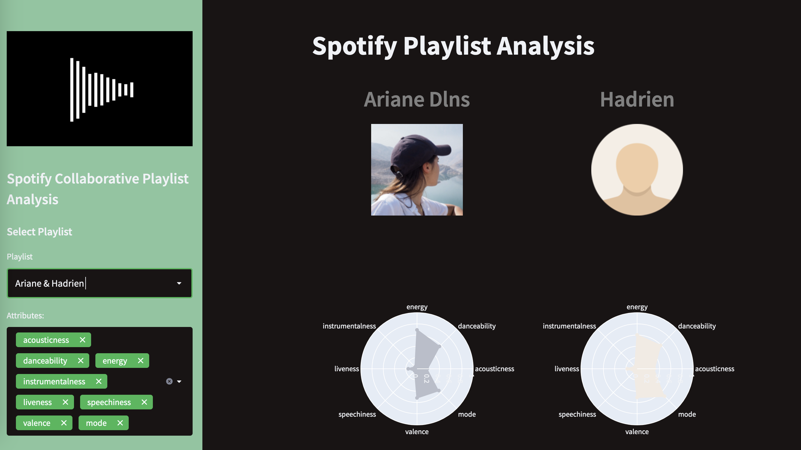

[](https://www.python.org/)
[](https://github.dev/ArianeDlns/spotify-dev/tree/main)

# Spotify Developer project

This repository is a compilation of fun personal exploration of the Spotify API

## 1. First project: exploration of collaborative playlist
Haven't you always wondered who contributed the most to your collaborative playlist?

> <b>:bulb: **<font color='green'>Explore:</font></b>** Collaborative playlists and provide insights


How to run:
```bash
streamlit run spotify_dev_app/spotify_colab_exploration.py
```

[](https://developer.spotify.com)

**Technologies used**: Spotipy, Streamlit, Pandas, Plotly

## 2. Second project: Spotify playlist recommender

> <b>:warning: **<font color='orange'>WIP:</font></b>** Idea for a future project, find among spotify curated playlists the one that best matches your mood (i.e. recently played songs)

## Thanks
[Sam Hardy](https://github.com/samhardyhey) for ``clean_py notebook/NOTEBOOK.ipynb`` source code: [here](https://github.com/samhardyhey/clean-py)
